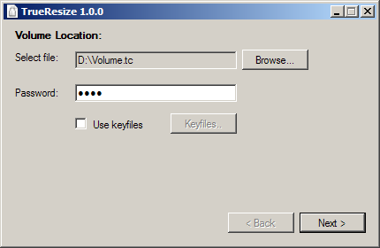
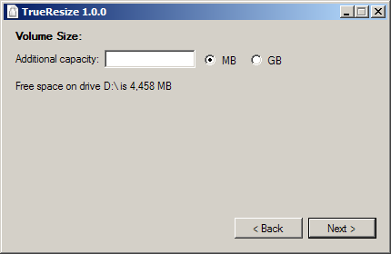

About TrueResize:
====================
TrueResize is a free, open source program written in C# designed to extend TrueCrypt volumes.

What this program can do:
===================================
What this program can do:
1. Extend TrueCrypt encrypted file containers.  
2. Extend TrueCrypt encrypted partitions on virtual disks (VHD / VMDK).  
- Hidden volumes are NOT supported.  
- The FAT filesystem is not supported.  

Warning:
========
The software may contain bugs and/or limitations that may result in data loss.  
I take no responsibility for any data loss that may occur.  

Contact:
========
If you have any question, feel free to contact me.  
Tal Aloni <tal.aloni.il@gmail.com>
